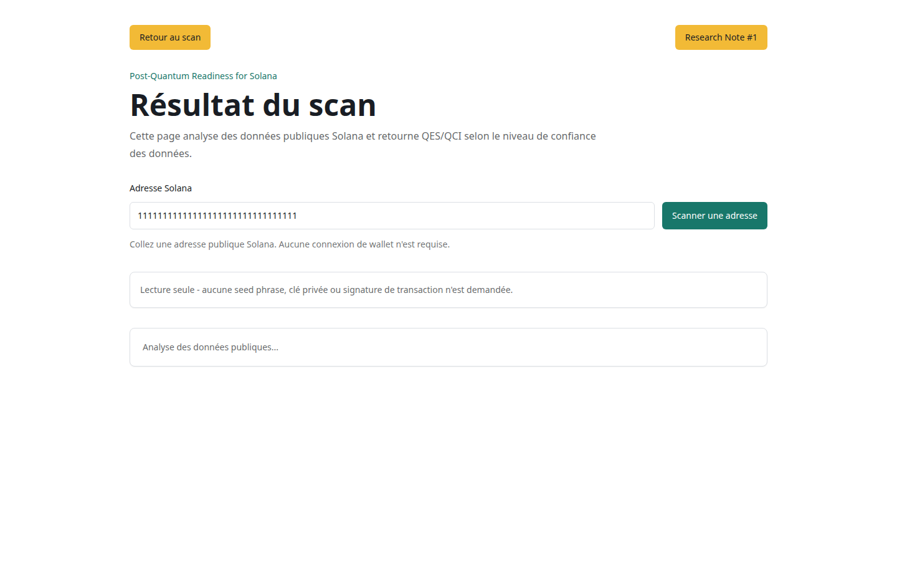
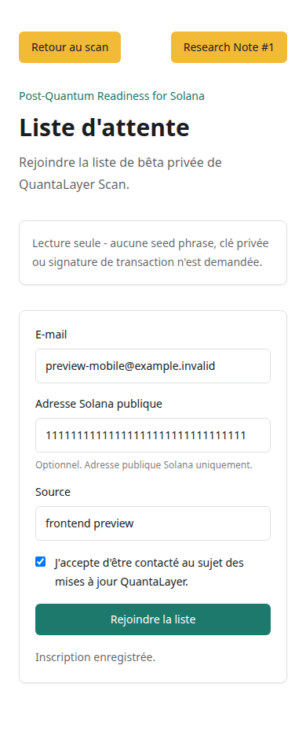
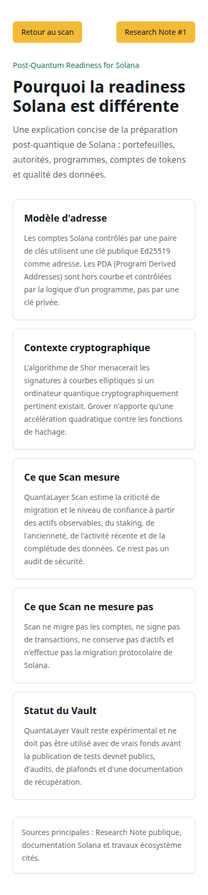
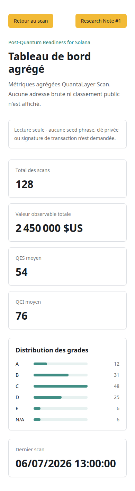
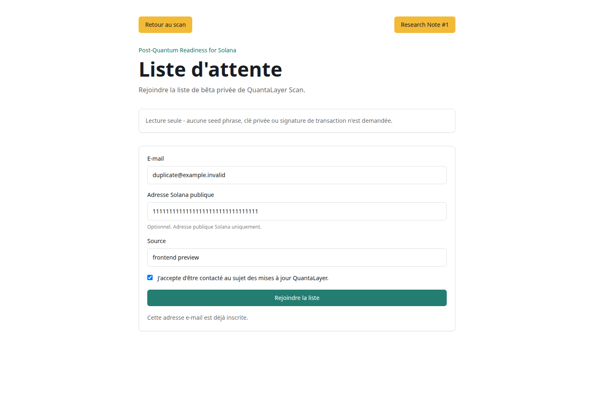

# QuantaLayer Scan Frontend Preview

Date: 2026-07-06

Branch: `polish/frontend-pre-staging`

## Quick Visual Review


### Landing


### Scan Result


### Edge And Transient States




### Other Pages


### Mobile Additions





### Waitlist States




## Founder Review Checklist

- [ ] Landing gives an institutional, non-memecoin impression.
- [ ] Scan input is visible immediately.
- [ ] Read-only warning is visible.
- [ ] QES/QCI are understandable without explanation from the founder.
- [ ] Low-confidence state does not overclaim.
- [ ] PDA state is understandable.
- [ ] Waitlist consent is explicit.
- [ ] Learn page is sober and not fear-driven.
- [ ] Stats page contains no raw wallet address.
- [ ] Stats grade bars improve scanability without becoming a leaderboard.
- [ ] OG card is shareable.
- [ ] Public beta remains blocked until human review clears the visual and wording gates.

## Founder Review Notes

### Immediate visual decisions

- Does the landing feel institutional enough?
- Is the QES/QCI explanation understandable without oral explanation?
- Is the warning language sober enough?
- Is the stats dashboard useful without becoming a leaderboard?
- Is the waitlist form sufficiently trustworthy?

### Before private beta

- Validate mobile readability on real phone.
- Validate French wording.
- Validate dashboard grade bars.
- Validate OG card shareability.

## Local Launch

The frontend was launched through the existing Playwright web server configuration in
`apps/web/playwright.config.ts`.

Command used for capture:

```bash
FRONTEND_PREVIEW=1 NEXT_PUBLIC_API_URL=http://127.0.0.1:3001 \
  pnpm --filter @quantalayer/web exec playwright test e2e/frontend-preview.spec.ts --project=chromium
```

The Playwright web server runs:

```bash
pnpm dev
```

The app was served at `http://localhost:3000`, equivalent for local review to
`http://127.0.0.1:3000`.

The following routes returned `200 OK` locally during preview generation:

- `http://127.0.0.1:3000`
- `http://127.0.0.1:3000/waitlist`
- `http://127.0.0.1:3000/learn/why-solana`
- `http://127.0.0.1:3000/stats`

## Gallery Pack

The GitHub-friendly gallery assets were generated with:

```bash
pnpm exec tsx scripts/build-frontend-contact-sheet.ts
```

This writes:

- `gallery.html`: static responsive gallery with no external scripts, CDN or tracking.
- `00-contact-sheet.png`: visual contact sheet generated from `gallery.html` with the Playwright CLI.

## API Mocking

No live provider smoke was run. No Helius or Jupiter request was triggered.

The preview test uses Playwright `context.addInitScript()` to patch `window.fetch` only for:

- `POST /api/v1/scan`
- `GET /api/v1/stats`
- `POST /api/v1/waitlist`

All responses are synthetic and local to the browser session. The scan address used for preview is:

```text
11111111111111111111111111111111
```

Additional synthetic states are controlled through browser-local preview flags:

- delayed scan response for `15-scan-loading.png`;
- waitlist duplicate response for `16-waitlist-duplicate.png`;
- waitlist error response for `17-waitlist-error.png`.

The OG card is generated from the local Next route `/api/og/score` and does not call the backend.

## Captured Pages

| File                             | Page / state                | Dimensions |
| -------------------------------- | --------------------------- | ---------: |
| `00-contact-sheet.png`           | Contact sheet               |  1600x2646 |
| `01-landing-desktop.png`         | Landing, desktop            |  1440x1000 |
| `02-landing-mobile.png`          | Landing, mobile             |    390x982 |
| `03-scan-result-desktop.png`     | Scan success, desktop       |  1440x1668 |
| `04-scan-result-mobile.png`      | Scan success, mobile        |   390x2070 |
| `05-scan-low-confidence.png`     | Scan with QCI below 40      |  1440x1392 |
| `06-scan-pda-not-applicable.png` | PDA / not applicable state  |  1440x1336 |
| `07-scan-error.png`              | API error state             |   1440x900 |
| `08-waitlist.png`                | Waitlist success            |  1440x1000 |
| `09-learn-why-solana.png`        | Learn page                  |  1440x1200 |
| `10-stats-dashboard.png`         | Aggregate dashboard         |  1440x1200 |
| `11-og-score-card.png`           | OG score image              |   1200x630 |
| `12-waitlist-mobile.png`         | Waitlist success, mobile    |    390x930 |
| `13-learn-mobile.png`            | Learn page, mobile          |   390x1672 |
| `14-stats-mobile.png`            | Aggregate dashboard, mobile |   390x1410 |
| `15-scan-loading.png`            | Scan loading state          |   1440x900 |
| `16-waitlist-duplicate.png`      | Waitlist duplicate state    |  1440x1000 |
| `17-waitlist-error.png`          | Waitlist error state        |  1440x1000 |

## UI/UX Observations

### Landing

- Logo is visible and not pixelated at the captured sizes.
- Core message is clear and restrained.
- Scan field is visible without scroll on desktop and mobile.
- Read-only disclaimer is visible before secondary links.
- Research Note, Learn, Waitlist and Stats CTAs are visible.
- Mobile layout stacks cleanly without horizontal overflow.

### Scan Result

- QES, QCI and grade are legible.
- Estimated migration exposure value is prominent and readable.
- Address wraps without breaking the card layout.
- Breakdown, limitations and recommendations are understandable.
- Loading state is now captured separately with concise, sober copy.
- Error state is sober and does not expose provider details.

### Low Confidence

- No grade is displayed.
- QCI is visually downgraded through the secondary color.
- The UI states that the grade is hidden because data is insufficient.
- Empty breakdown state shows explanatory text instead of an empty card.

### PDA / Not Applicable

- Grade displays as `N/A`.
- The UI states that the grade is not applicable for this address.
- Recommendation points the user toward the owning program and authorities.
- Empty breakdown state shows explanatory text.

### Waitlist

- Consent checkbox is visible and explicit.
- Optional public Solana address field is visible and clearly labelled.
- Submit button is readable.
- Mocked success, duplicate and error states are visible.
- Error copy is generic enough for scan and waitlist contexts.

### Learn

- Content is concise and not FUD-oriented.
- Sources are visible.
- Mobile capture confirms long-form cards remain readable; real-phone review remains required.

### Stats

- Dashboard contains aggregate metrics only.
- No raw wallet address, leaderboard or per-wallet ranking is displayed.
- Grade distribution now uses compact bars with visible grade labels and textual counts.
- Bars remain proportional to aggregate counts and expose accessible meter values.

### OG Card

- Address is truncated.
- QES, QCI and grade are readable.
- Caption is factual: `Migration Readiness Score`.
- No protection or quantum-safe claim is present.

## Visual Issues Found

- Stats grade distribution was readable but textual only.
- Loading state was not captured separately.
- Waitlist duplicate and error states were not present in the visual pack.
- Additional mobile captures were missing for waitlist, learn and stats.
- FR wording included a few English-leaning labels and an ambiguous shared API error string.

## Corrections Made

- Stats dashboard now displays compact grade bars using aggregate data only.
- Preview capture now includes mobile waitlist, learn and stats pages.
- Preview capture now includes scan loading, waitlist duplicate and waitlist error states.
- Gallery HTML and contact sheet were regenerated from the updated screenshot list.
- FR copy was tightened for loading, stats title, waitlist labels, Solana explanatory text and shared API error wording.

## Corrections Not Made

- No backend/API/scoring/database behavior was changed.
- No smoke or staging script was changed.
- No Research Note PDF was changed.
- No global visual redesign was attempted.
- Vault, Notary and Authority Exposure product surfaces were not modified.
- Public beta remains explicitly blocked pending human review.
