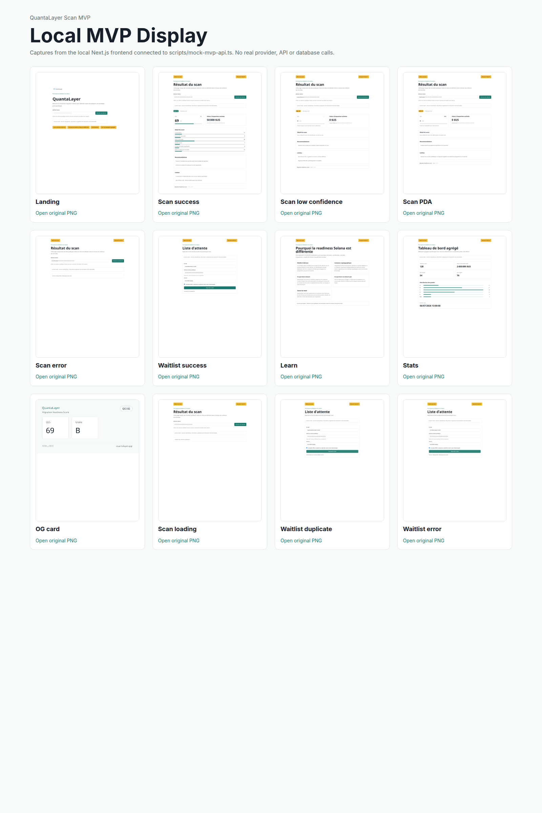
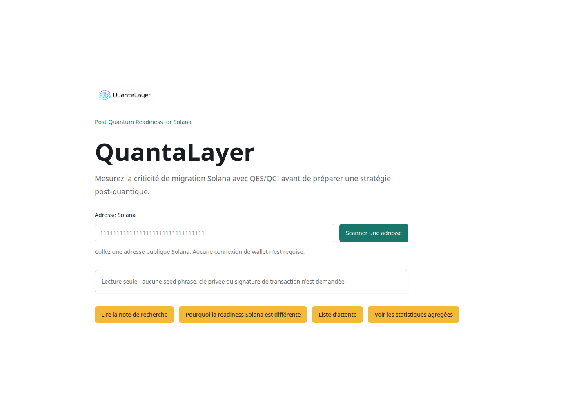
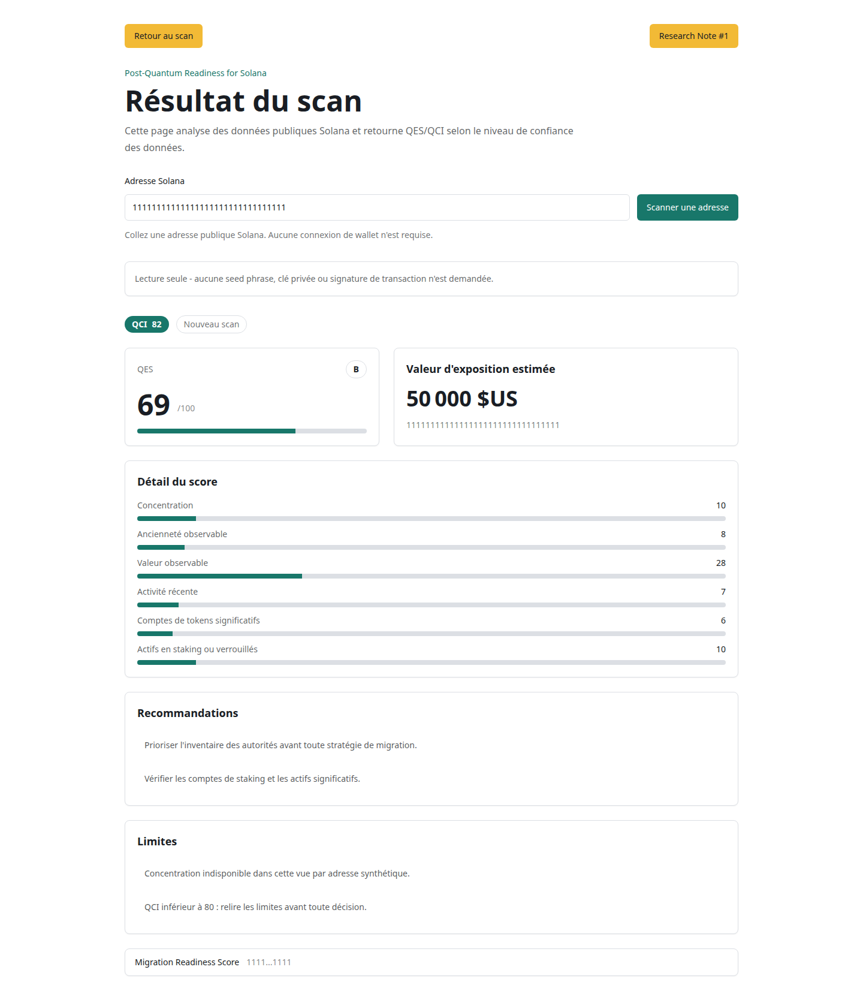
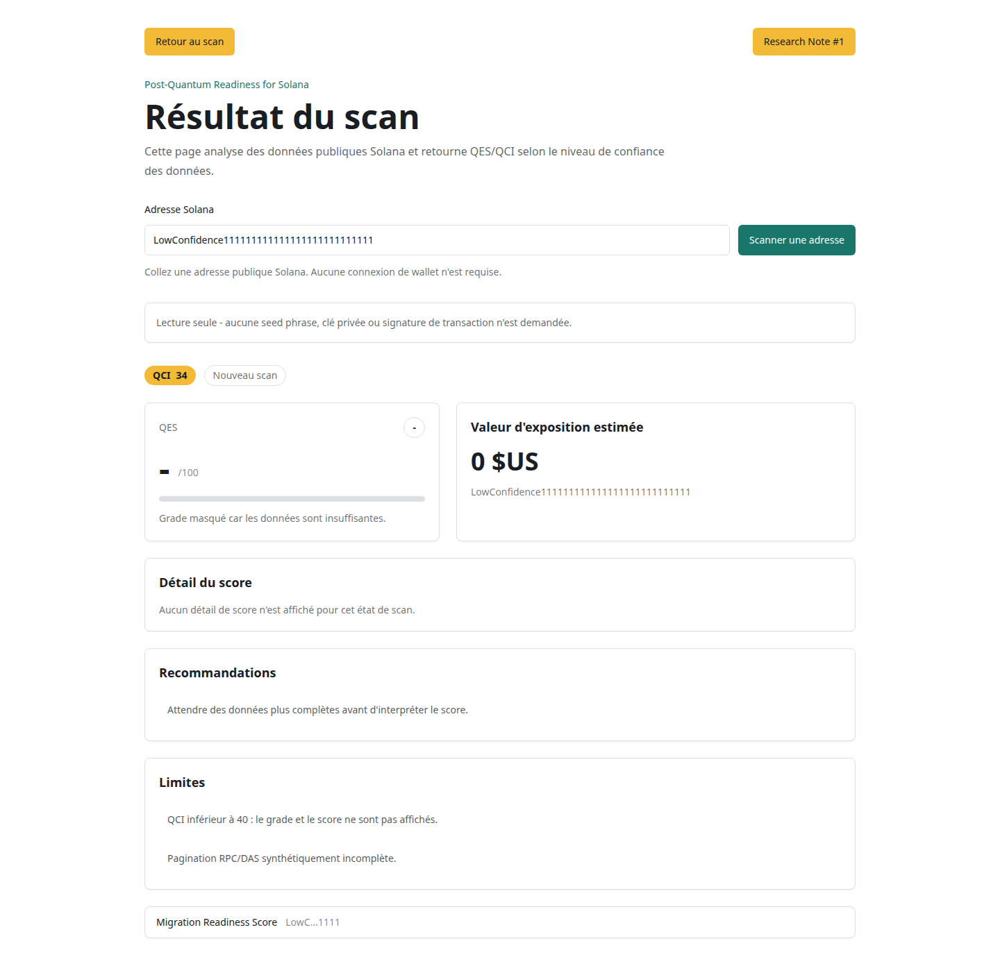
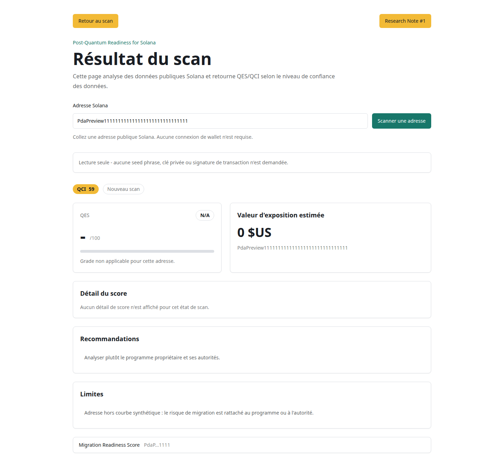
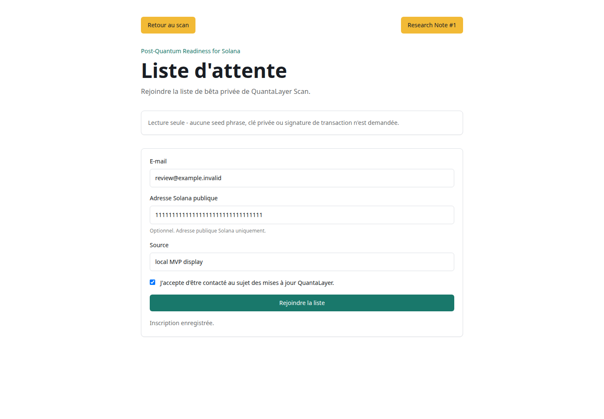
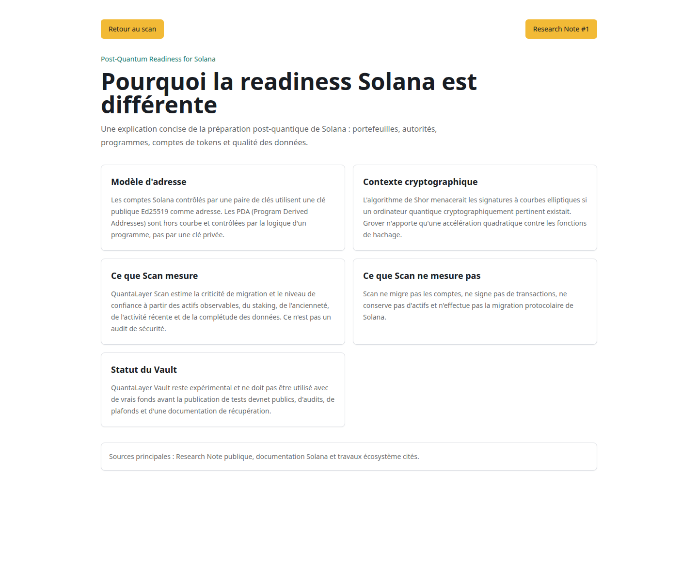
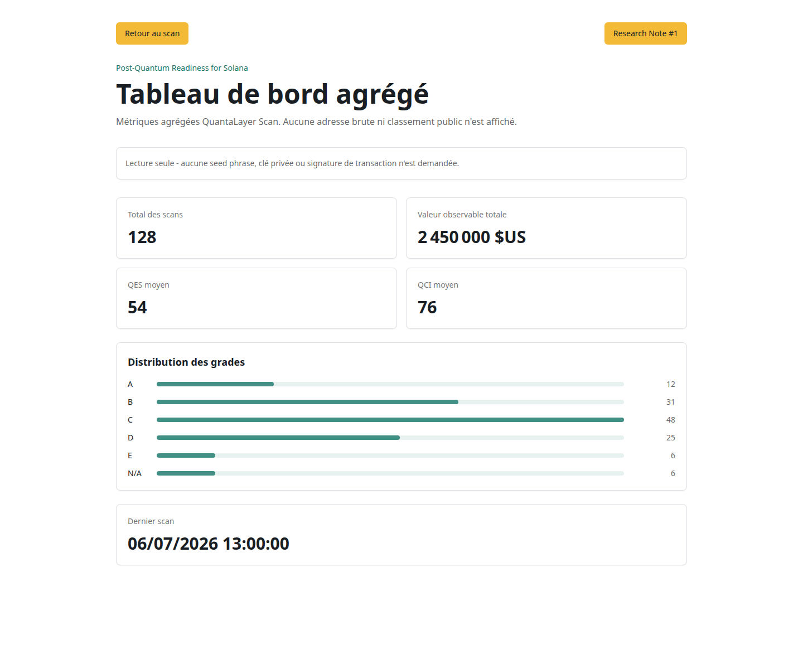
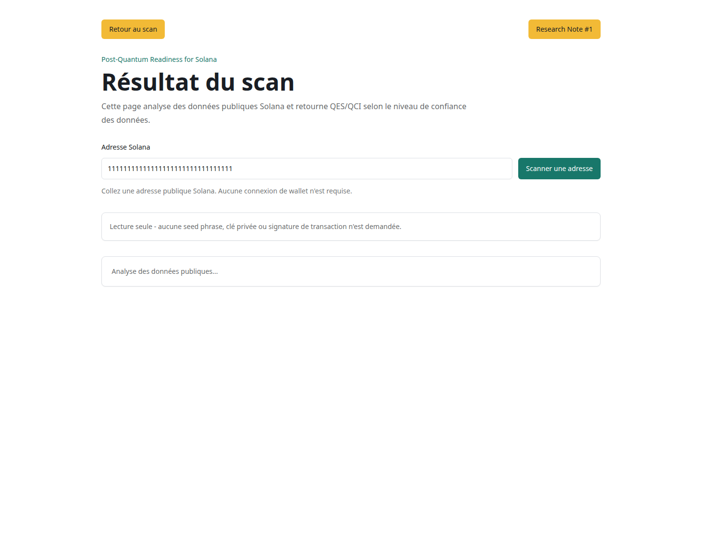
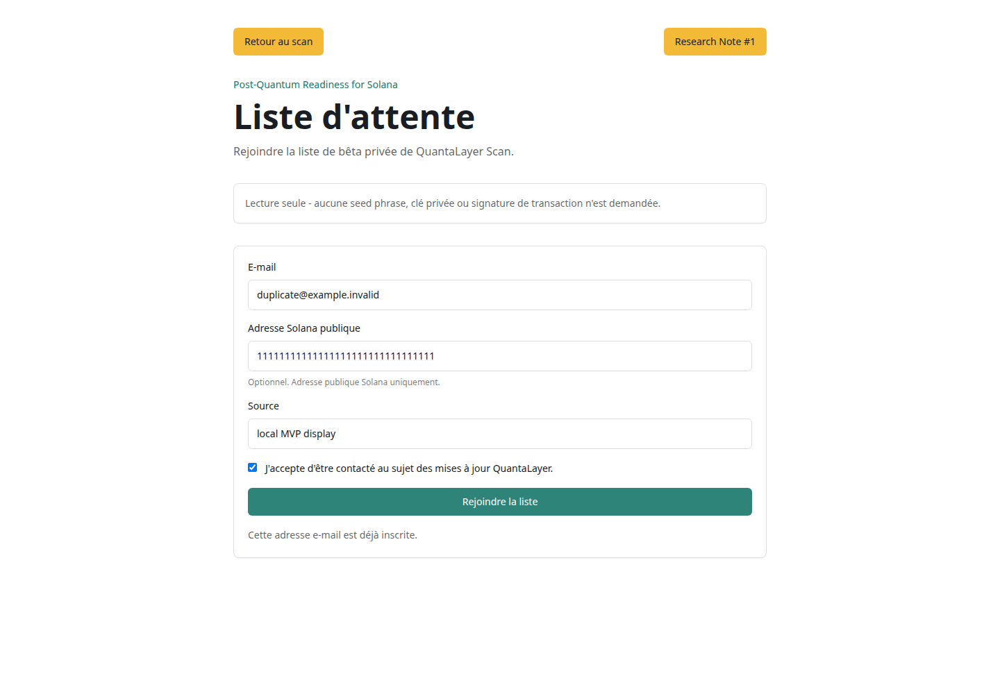

# QuantaLayer Local MVP Display

Date: 2026-07-06

Branch: `review/local-mvp-display`

## Launch

- Web URL: `http://127.0.0.1:3000`
- Mock API URL: `http://127.0.0.1:3101`
- Command used: `MOCK_API_PORT=3101 bash scripts/start-local-mvp-review.sh`
- Backend real providers used: no
- Helius/Jupiter used: no
- PostgreSQL/Redis used: no

Note: `127.0.0.1:3001` was already occupied by an unrelated local Docker service
(`nexus-app-prod`). The QuantaLayer mock API was therefore launched on the documented configurable
port `3101`, and the web process was started with `NEXT_PUBLIC_API_URL=http://127.0.0.1:3101`.
This avoided using the unrelated service on port `3001`.

## Pages Verified

| Page                | URL                                                                    | Status |
| ------------------- | ---------------------------------------------------------------------- | -----: |
| Landing             | `http://127.0.0.1:3000`                                                |    200 |
| Scan success        | `http://127.0.0.1:3000/scan/11111111111111111111111111111111`          |    200 |
| Scan low confidence | `http://127.0.0.1:3000/scan/LowConfidence111111111111111111111111111`  |    200 |
| Scan PDA            | `http://127.0.0.1:3000/scan/PdaPreview111111111111111111111111111111`  |    200 |
| Scan error          | `http://127.0.0.1:3000/scan/ErrorPreview11111111111111111111111111111` |    200 |
| Waitlist            | `http://127.0.0.1:3000/waitlist`                                       |    200 |
| Learn               | `http://127.0.0.1:3000/learn/why-solana`                               |    200 |
| Stats               | `http://127.0.0.1:3000/stats`                                          |    200 |
| OG card             | `http://127.0.0.1:3000/api/og/score?...`                               |    200 |

Mock API health response:

```json
{ "mode": "frontend-review", "service": "quantalayer-mock-api", "status": "ok" }
```

## Visual Review

- Landing: serious and institutional. The scan field is immediately visible on desktop. The
  read-only warning is visible before secondary links.
- Scan result: QES/QCI are understandable without oral explanation. The exposure value is prominent
  but labelled as an estimate, which keeps the tone factual. Warnings are visible in a dedicated
  section, though the founder should validate the French wording.
- Low confidence: absence of grade is clear. The UI avoids false precision by hiding QES and showing
  an insufficient-data message.
- PDA: `N/A` is understandable with the dedicated message. The recommendation correctly points the
  user toward the program/authority layer.
- Error: the message is sober and does not expose provider details.
- Waitlist: the form is restrained and trustworthy. Consent is explicit. The optional Solana address
  field is labelled as public-only. Success, duplicate and error states are visible.
- Learn: tone is sober and not FUD-oriented. Claims remain bounded by the MVP copy.
- Stats: distribution bars are readable, compact and aggregate-only. The absence of leaderboard or
  wallet ranking is explicit in the page description.
- OG: card is shareable. The address is truncated as `1111...1111`.

## Strict UI Review Answers

### Landing

- Product sérieux / institutionnel ? Yes.
- Champ scan immédiatement visible ? Yes.
- Warning read-only visible ? Yes.

### Scan

- QES/QCI compréhensibles sans explication orale ? Mostly yes; human wording review still useful.
- Valeur d'exposition trop anxiogène ? Correctly formulated as estimated exposure value.
- Warnings assez visibles ? Yes, in a separate limitations section.

### Low Confidence

- Absence de grade claire ? Yes.
- Fausse précision évitée ? Yes.

### PDA

- `N/A` compréhensible ? Yes.
- Orientation program / authority claire ? Yes.

### Waitlist

- Formulaire de confiance ? Yes.
- Consentement suffisamment clair ? Yes.
- Champ wallet optionnel compris comme public uniquement ? Yes.

### Learn

- Ton sobre ? Yes.
- Page non-FUD ? Yes.

### Stats

- Barres de distribution lisibles ? Yes.
- Absence de leaderboard évidente ? Yes.

### OG

- Card partageable ? Yes.
- Adresse tronquée ? Yes.

## Screenshots
















## Screenshot Inventory

| File                               | Source                                 | Dimensions |
| ---------------------------------- | -------------------------------------- | ---------: |
| `00-local-contact-sheet.png`       | Local gallery contact sheet            |  1600x2400 |
| `01-local-landing.png`             | Local web + mock API                   |  1440x1000 |
| `02-local-scan-success.png`        | Local web + mock API                   |  1440x1668 |
| `03-local-scan-low-confidence.png` | Local web + mock API                   |  1440x1392 |
| `04-local-scan-pda.png`            | Local web + mock API                   |  1440x1336 |
| `05-local-scan-error.png`          | Local web + mock API                   |  1440x1100 |
| `06-local-waitlist.png`            | Local web + mock API                   |  1440x1000 |
| `07-local-learn.png`               | Local web + mock API                   |  1440x1200 |
| `08-local-stats.png`               | Local web + mock API                   |  1440x1200 |
| `09-local-og-card.png`             | Local Next OG route                    |   1200x630 |
| `10-local-scan-loading.png`        | Local web + delayed mock scan response |  1440x1100 |
| `11-local-waitlist-duplicate.png`  | Local web + mock API                   |  1440x1000 |
| `12-local-waitlist-error.png`      | Local web + mock API                   |  1440x1000 |

## Local Mock Data

Scan states:

- `11111111111111111111111111111111` -> success
- `LowConfidence111111111111111111111111111` -> low confidence
- `PdaPreview111111111111111111111111111111` -> PDA / not applicable
- `ErrorPreview11111111111111111111111111111` -> synthetic 502 problem+json

Waitlist states:

- normal e-mail -> success
- e-mail containing `duplicate` -> duplicate
- e-mail containing `error` -> synthetic 500 problem+json

## Notes

- Captures were generated from the local web process connected to `scripts/mock-mvp-api.ts`.
- No `context.addInitScript()` network mock was used for this pack.
- No Helius, Jupiter, PostgreSQL, Redis, staging API or production API call was required.
- Public beta remains blocked pending human review and staging validation.
